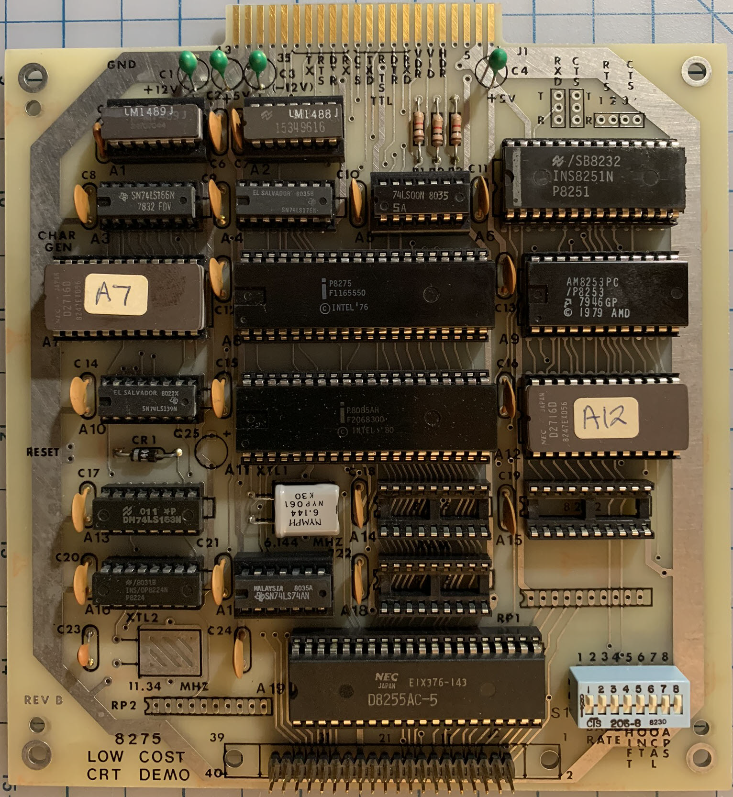
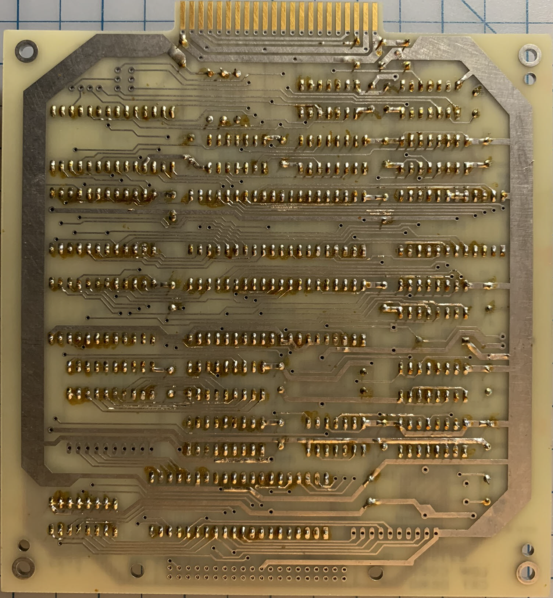

# John Bell Engineering CRT Controller board
Circa 1981
# Board #
## Key Components ##
* Intel [8275](https://en.wikipedia.org/wiki/Intel_8085#MCS-85_family) - Programmable CRT Controller
* Intel [8251](https://en.wikipedia.org/wiki/Intel_8251) - Universal synchronous and asynchronous receiver-transmitter (UART)
* Intel [8253](https://en.wikipedia.org/wiki/Intel_8253) - Programmable Interval Timers
* Intel [8255](https://en.wikipedia.org/wiki/Intel_8255) - Programmable Peripheral Interface
* Intel [8085](https://en.wikipedia.org/wiki/Intel_8085) - 8 bit microprocessor
## Schematic ##
See pages 3 and 4 of the [manual](./docs/JohnBellEngineeringCrtControllerListing.pdf).
## Front ##

## Back ##
