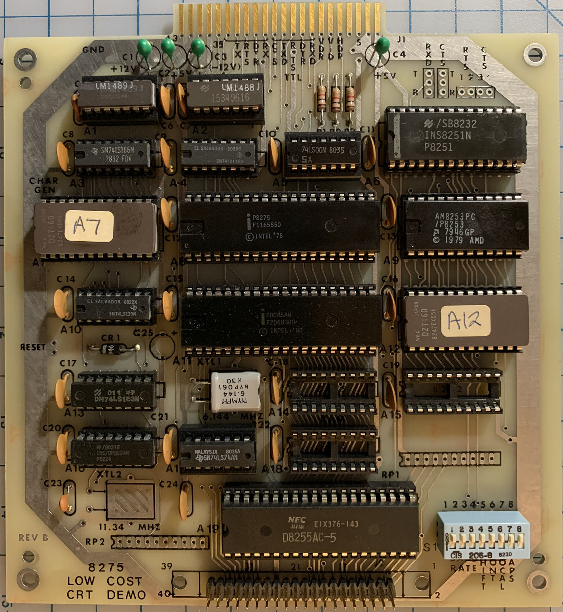
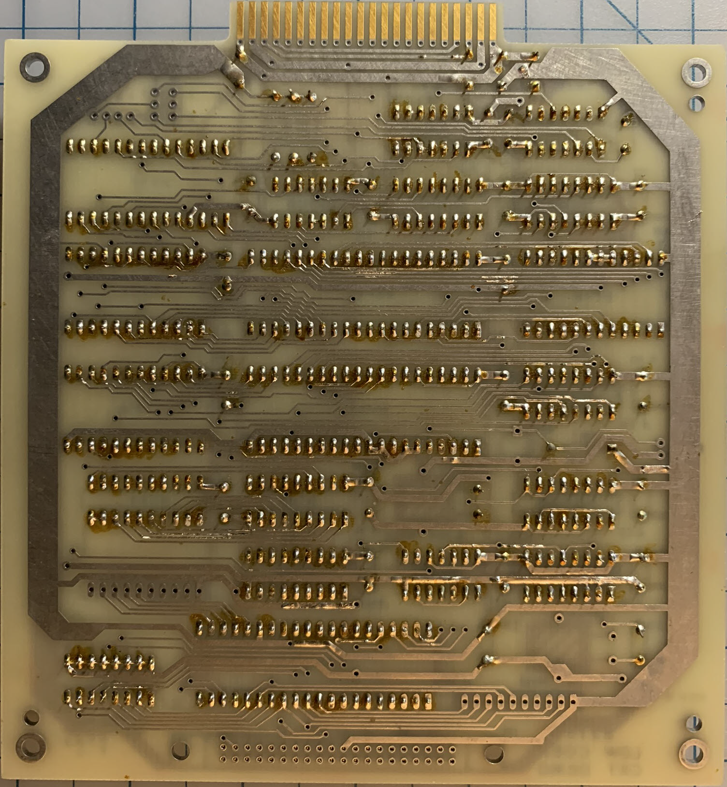

# John Bell Engineering CRT Controller board
Circa 1981
# Board #
## Key Components ##
* Intel [8275](https://en.wikipedia.org/wiki/Intel_8085#MCS-85_family) - Programmable CRT Controller
* Intel [8251](https://en.wikipedia.org/wiki/Intel_8251) - Universal synchronous and asynchronous receiver-transmitter (UART)
* Intel [8253](https://en.wikipedia.org/wiki/Intel_8253) - Programmable Interval Timers
* Intel [8255](https://en.wikipedia.org/wiki/Intel_8255) - Programmable Peripheral Interface
* Intel [8085](https://en.wikipedia.org/wiki/Intel_8085) - 8 bit microprocessor
## Schematic ##
See pages 3 and 4 of the [manual](./docs/JohnBellEngineeringCrtControllerManual.pdf).
## Front ##

## Back ##

### BASIC CONFIGURATION
As shown in the schematic the heart of the controller is an 8085А
8-bit microprocessor operating at 3MHz and supported by two 8185
1K x 8 static RAM memories and a 2716 control software PROM. An
8251A programmable communication interface provides synchronous or
asynchronous serial communications. Baud rates are selected by
means of switches contained on the board and the baud rate clock
is generated by the 8253 programmable interval timer under software 
control. An 8255A provides three 8-bit parallel I/O ports,
two of which are utilized for keyboard scanning. The third port
is used to sense option switch settings and to sense the vertical
retrace signal from the 8275 for CRT synchronization.

The CRT interface is controlled by an 8275 programmable CRT controller. 
The CRT dot and character timing is generated by an 8224
clock generator. A second channel of the 8253 timer provides the
appropriate horizontal retrace timing for the CRT monitor. A 2716
EPROM is utilized to provide a user-programmable character generator, 
and a shift register transforms the data from the character
EPROM into a serial bit stream to illuminate dots on the CRT screen.
The 2716 character generator makes it possible to display special
symbols for word processing or industrial control applications or
to display characters and words in a foreign language.

### SYSTEM ARCHITECTURE
The controller hardware is divided into three sections: processor
and support, serial and parallel I/O, and CRT control. The processor 
and support section consists of an 8085A microprocessor, two
8185 1K x 8 static RAM devices, and a 2716 EPROM (containing 2K
bytes of control firmware). The 8085A uses a 6 MHz crystal in order
to operate at a 3MHz clock rate. The 8185 memories attach directly
to the 8085A multiplexed bus. An 8282 is used to latch eight address
lines (A0-A7) from the multiplexed bus for 2716 program memory access
(as shown in Figure 3).

The 8253 contains three independent timers and generates two timing
signals for the controller. The first timer is operated in a programmable
one shot mode, generating a 32 microsecond horizontal retrace pulse for
the Ball Brothers TV-12 CRT monitor used in this
design. A simple software change allows the user to modify this
delay time for different CRT monitors.

A second timer is used to generate 8251A baud rate. Three switches
are monitored by the 8085A to determine the desired baud rate. When
the CPU detects a change in the switch positions, the 8253 is loaded
with the appropriate count for the new baud rate. The third timer
is available for customer use.
All I/O operations of the controller are memory mapped.
Please note the output is not NTSC standard.

### SERIAL AND PARALLEL I/O
The CRT controller board communicates to computer systems and other
CRT units through a serial interface. Both RS-232C and TTL compatible interfaces are available at the J1 connector. The unit's
standard software supports data transmission rates of 9600, 4800,
2400, 1200, 600, 300, 150, and 110 baud. These rates are switch selectable on the board. Since the baud rate clock is generated by
an 8253, these rates may be easily modified in software.

Keyboard scanning is supported through the A and B ports of the 8255A
programmable peripheral interface. The eight scan lines (Port B)
and eight return lines (Port A) support a 64 contact closure key matrix. Three switches are attached to Port C to permit baud rate
selection. Four additional general purpose inputs on Port C permit
the software to sense depression of the Caps Lock key, the Control
key, and the Shift key as well as the position of the Line/Local
switch. The last input on Port C is used to sense the status of the
VRTC (vertical retrace) output of the 8275 so that the controller
can synchronize with the CRT display on power up or after a hardware reset.

All keyboard I/O is connected to the controller by means of a 40 pin
header on the edge of the board. All seven option switch inputs are
also brought to the connector so that option switches may be installed on the keyboard if desired.

### CRT CONTROL
The CRT display is controlled by an 8275 programmable CRT controller.
This device permits software specification of most CRT screen format characteristics such as the cursor position, the number of characters per row, and the number of rows per frame (screen). The 8275 handles all display timing including retrace time delays.

In the current design, 2000 characters are displayed on the CRT
screen (25 rows of 80 characters). Each character is formed as a
5 by 7 dot matrix within a larger 7 by 10 matrix (Figure 4). Other
screen formats (e.g., the popular 16 rows of 64 characters) can be
easily implemented with minimal software changes.

### SCREEN REFRESH
The 8275 contains two 80 character row buffers. While one buffer is
used to display the current character line on the screen, the 8275
fills the other row buffer from memory. This data transfer begins
when the 8275 issues a data request (by means of the DRQ pin), causing
an interrupt to the CPU. In response to this interrupt, the CPU
activates the RAM's CS and RD inputs while simultaneously activating
the 8275's DACK and WR inputs. With this technique, a single bus
cycle is used to transfer each byte from the RAM into the CRT row
buffer. After the row buffer is filled, the CPU exits the interrupt
service routine.

### ATTRIBUTES
The 8275 can do much more than simply paint characters on a CRT screen.
In this implementation, the end of row-stop DMA command code allows
the control software to easily blank individual display lines or to
perform an erase to end of screen function.

The 8275 supports software selection of character attributes. Command
codes to turn these attributes on and off may be embedded in the display line buffer. Attributes are used to blink, underline, or highlight (intensify) characters on the screen. Attributes also control
the reverse video display (black letters on a white background)
capability. Two general purpose attributes are also provided to control unique user-designed display capabilities.

### DISPLAY TIMING AND SUPPORT
The 8275 is supported by three hardware functions (Figure 4): a dot/character clock oscillator, a PROM/ROM character generator, and a
character shift register. The dot/character clock oscillator consists of an 8224 operating at 11.34 MHz and providing an 87.5 nanosecond dot clock. A 74LS163 divides this clock by 7 to generate a
1.63 MHz (612 nanosecond) character clock. The 8275 is programmed
to display one raster line every 61.2 microseconds — a complete character line every 612 microseconds (10 raster lines). The 8275 is
also programmed to refresh the screen every 16.5 milliseconds (60.5
Hz).

Each character row consists of ten raster lines. Seven lines are
used to display the 5 x 7 matrix characters, two lines are blanked
for row spacing, and one line displays the cursor and underline.

The 8275 uses the LC0-LC3 outputs to indicate the current raster line
during the display of each character. These outputs, combined with
the character code outputs (CC0-CC6), are input to the 2716 in order
to generate the dot pattern for display. This dot pattern is loaded
into the shift register and is serially clocked for display by the
11.34 MHz dot clock.

During the vertical retrace interval, the row buffer for the first
line of the next frame is loaded by the 8085A. When the frame starts,
the 8275 outputs the first character on its CC0-CC6 pins; the LC
outputs are all zero. 612 nanoseconds later, the next character code
is emitted by the 8275. This process is repeated until all 80 characters have been output. At this time, the 8275 generates a horizontal retrace pulse. The 8253 converts the HRTC pulse into the
appropriate pulse width for the CRT monitor.

At the end of the first raster line, the 8275 increments the LC outputs. The next nine raster lines are similar to the first — the
8275 outputs the same 80 character codes on the CC0-CC6 pins for
each of the raster lines, and the LC outputs are incremented after
each raster.

While the ten raster lines are being displayed, the 8275 is also
filling the next row buffer. After the tenth raster line is completed, the 8275 resets the LC count, and outputs character codes
for the second row on the CC0-CC6 pins. As this row is displayed,
the first row buffer is filled with information for the third row.
The 8275 alternates row buffers until all 25 rows are displayed.
At this time, the VRTC signal is activated, and the complete process is repeated for the next frame.

During the display, the 8275 automatically activates the VSP and
LTEN outputs as appropriate to control retrace blanking, to generate the cursor, or to underline characters.

### FOREGROUND AND BACKGROUND SOFTWARE
The software for the CRT controller is divided into two sections.
The first section controls high priority foreground tasks. This
foreground software is activated each time the 8275 requests an 80
character display line buffer (through the 8085A RST6.5 interrupt).
The CRT line buffer is filled by performing 80 sequential memory
reads. As each read is performed, the hardware automatically sends
a write/DMA acknowledge to the 8275. The presence of simultaneous
memory read and 8275 write commands effects the transfer of a character from the 8185 RAM to the 8275 in a single memory cycle (without a DMA controller). In the interest of minimum execution time, the 80 reads are actually performed using the CPU stack pointer and
40 POP instructions. The complete refresh sequence for one line
requires approximately 210 microseconds. This sequence is repeated
every 612 microseconds. Processor overhead for refresh operations
is approximately 35%.

Keyboard scanning is also included in the foreground software. However, this scanning is performed only at the end of each display
frame (after 25 lines/16.5 milliseconds). If a key depression is
noted during one of these scans, the information is stored for further
background processing.

The second software section handles background processing. Tasks to
be performed in the background include monitoring the 8251A serial
I/O port, debouncing the keyboard, and processing characters entered
by means of either the keyboard or the serial interface. This background software executes continuously except when interrupted for the
higher-priority foreground processing.

### REFRESH BUFFER MANAGEMENT
The 2000 characters to be displayed on the CRT screen are stored in
a memory area commonly called the refresh buffer. The foreground
software transfers one line (of 80 characters) at a time to the 8275.
Two pointers are used during normal operation. The current line
pointer contains the address of the next line to be displayed, and
the buffer pointer contains the address of the next CRT buffer location to be written into (from either the keyboard or the serial
port). The foreground processing software controls the current line
pointer. This pointer must always be correct so that a line can be
transferred to the 8275 when requested. The buffer pointer, on the
other hand, normally indicates the current cursor location.

The simplest refresh buffer organization associates the first memory
address with the upper left position on the CRT screen. All other
characters are stored sequentially as shown in Figure 5. The major
disadvantage of this method is the difficulty of scrolling. Scrolling a CRT screen requires that each display line be moved up one
row (the top line of the CRT is lost). The bottom line is blanked
and the cursor is placed at the beginning of this line. In order
to scroll the screen with this fixed sequential organization, all
characters in the refresh buffer must be moved forward by 80 characters (memory locations). This action moves each line up one row on
the CRT. The last 80 characters in the buffer are then blanked.
Moving 1840 characters each time the screen scrolls a single line is
a very slow and cumbersome scrolling technique.

This low cost CRT controller uses a slight modification of the previously described technique that keeps the sequential memory orientation while at the same time eliminating the need to move characters
in memory. This technique requires an additional display start
pointer that points to the memory location of the first character to
be displayed on the screen. At system initialization, the display
start pointer is set to 6000H. During each vertical retrace interval, the current line pointer is initialized from the display start
pointer. Scrolling is performed by merely changing the display start
pointer and blanking the old first line (which becomes the new final
line) on the CRT screen.

To perform a single line scroll, the display start pointer is moved
ahead 80 characters to location 6050H and the first 80 characters
in the buffer are blanked. During the next vertical retrace, the
foreground software sets the current line pointer to the display
start location (6050H), and begins transferring characters to the
8275 from this address. The character in memory location 6050H
(previously the first character in the second row) now occupies the
first display position on the CRT screen (first character of the
first row). When the foreground software reaches the end of the
display buffer, the next line is read from the beginning of the
buffer (location 6000H). This action causes the first 80 characters
in the buffer to appear on the last display line (Figure 6). Each
subsequent scroll moves the display start pointer forward by 80
characters, and all buffer operations automatically roll over to
the physical beginning of the buffer after passing the last buffer
location.

Since the line-by-line display of characters is controlled by the
8085A software, other display techniques may be used. In particular, a linked list structure is extremely adaptable to word processing and text editing functions. This method allows each line (within a file) to be changed independently of other lines. The lines
are linked or chained together by pointers. Lines may be easily inserted or deleted by simply changing pointers. To display a CRT frame,
the processor follows the pointer chain from one line to the next.

### KEYBOARD INTERFACE
The keyboard used in this design was a simple unencoded ASCII keyboard. In order to keep the cost to a minimum a simple scan matrix
technique was implemented by using two ports of an 8255 parallel I/O
device.

When the system is initialized the contents of the eight keyboard RAM
locations are set to zero. Once every frame, which is 16.67 milliseconds, the contents of the keyboard RAM is read and then rewritten
with the contents of the current switch matrix. If a nonzero value
of one of the keyboard RAM locations is found to be the same as the
corresponding current switch matrix, a valid key push is registered
and action is taken. By operating the keyboard scan in this manner
an automatic debounce time of 16.67 milliseconds is provided.

The figure below shows the actual physical layout of the keyboard
and Figure 2B shows how the individual keys were encoded. On Figure
2B the scan lines are the numbers on the bottom of each key position
and the return lines are the numbers at the top of each key position.
The Shift, Control and Caps Lock keys were brought in through separate
lines of Port C of the 8255.

In order to guarantee that two scan lines could not be shorted together
if two or more keys are pushed simultaneously, isolation diodes could
be added.